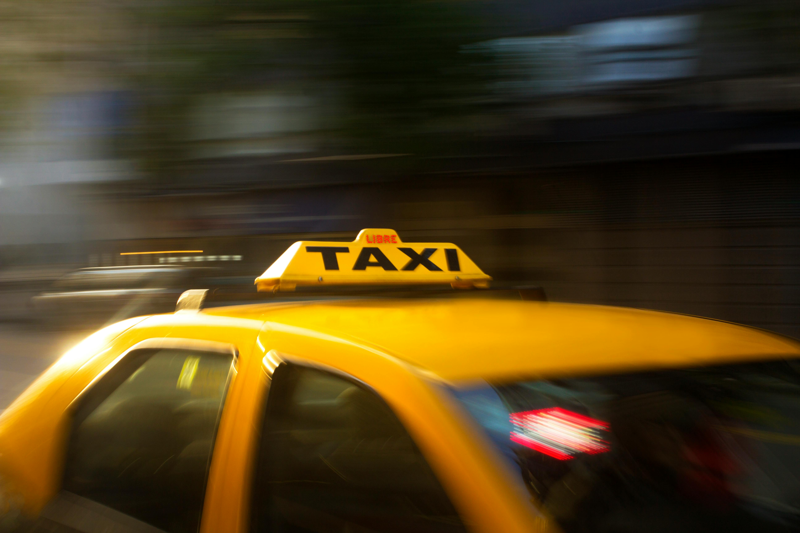

# **YorkNew Taxi Company - Capstone Report**

## **1. Project Overview**
This report analyzes the three-month performance of YorkNew Taxi Company. The goal is to assess revenue, trip distribution, customer behavior, and driver utilization to identify areas for improvement and growth.

## **2. Problem Statement**
YorkNew Taxi Company has collected customer and trip data over the past three months but lacks a structured approach to analyzing its performance. The company is unsure where to begin and needs insights into key metrics that impact its growth and operational efficiency. As a data analyst, the goal is to explore the dataset, uncover meaningful insights, and provide data-driven recommendations that will help the company improve its business strategy, optimize resources, and enhance customer retention. This analysis will guide YorkNew Taxi Company in making informed decisions to drive growth and profitability.

---
## **3. Data Source**
The data is sourced from the company’s trip records over three months, view [here.](https://docs.google.com/spreadsheets/u/0/d/1DJX9lUxzvNb6KVV95W7jbutr-F4LTmPZ7com0ndp2ys/edit?usp=drive_web&pli=1&authuser=0)

## **Methodology**

To extract meaningful insights and provide data-driven recommendations, the following **four-step methodology** was applied:

### 1. **Data Cleaning (Standardization)**
   - Standardized column names and formats for consistency.
   - Handled missing values and incorrect data entries.
   - Ensured uniform date and time formatting for accurate time-based analysis.

### 2. **Data Grouping**
   - Categorized trips based on **time of day** (Morning, Afternoon, Evening, Late Night).
   - Segmented trips by **distance** (Very Short, Short, Medium, Long).
   - Grouped revenue by **month** to identify performance trends.
   - Classified customers as **new vs. returning** for retention analysis.

### 3. **Data Modeling**
   - Created relationships between datasets to ensure accurate aggregations.
   - Calculated **trip distribution by vendors, time slots, and distance categories**.
   - Assessed driver utilization by **trip-to-driver ratio**.

### 4. **Creating Measures**
   - **Revenue-based measures:** Total revenue, revenue per trip, revenue per time slot.
   - **Operational efficiency measures:** Trips per driver, average fare per vendor, trip frequency by category.
   - **Customer-related measures:** Retention rate, new vs. returning customers, customer trip distribution.

### 5. **Data Visualization & Methods Used**
   - **Visualization Tools:** Power BI was used to create dynamic dashboards and charts for key insights.
   - **Charts & Graphs Used:**
     - **Bar charts** for revenue trends by month, vendors, and time categories.
     - **Pie charts** for customer segmentation (new vs. returning).
     - **KPI Cards** for visualising kpis
   - **Interactivity:** Filters were applied to drill down into specific customer behaviors, revenue sources, and trip distributions.

You can interract with the dashbooard [here.](https://app.powerbi.com/groups/me/reports/a75a0074-e567-46f1-a154-3f84095c5a2a?ctid=4331c42e-69e8-40d9-af18-dd96b78416b7&pbi_source=linkShare)

## **5. Key Insights**
### **Revenue & Performance Analysis**
- **Total revenue**: $19,734 over three months.
- **Best-performing month**: **July ($7,138)**, followed by May ($6,347) and June ($6,249).
- **Most profitable time category**: **Morning hours ($5,158)**, followed by evening hours ($4,975).**
- **Most frequent trip period**: Morning (265 trips), but evening had the second-highest revenue, possibly due to surge pricing or larger fares.

### **Driver Utilization Issue**
- With **594 drivers completing only 1,000 trips**, each driver averages **1.68 trips per quarter**, indicating **severe underutilization**.

### **Trip & Distance Analysis**
- **Long-distance trips (6km+) generated 63% of total revenue ($12,349).**
- **Very short trips (below 2km) contributed only $20, highlighting inefficiencies in short-distance pricing.**

### **Customer Insights**
- **94.61% of customers were new**, while only **5.39% were returning customers**, indicating low customer retention.

### **Vendor Performance**
- **Vendor V003 had the highest average fare ($20.7) but earned less revenue ($4,979) compared to V004 ($5,358).**
- **V004 completed more trips but had a slightly lower average fare.**

## **Conclusion**

The analysis of YorkNew Taxi Company’s performance over the past three months reveals several key insights. While the company generated a total revenue of **$19,734**, operational inefficiencies, particularly in **driver utilization and customer retention**, could hinder long-term growth. The **majority of revenue (63%) comes from long-distance trips**, making the business highly dependent on a specific trip category. Additionally, while July was the highest-grossing month, the company's overall trip volume remains low compared to the size of its workforce (**1.68 trips per driver over three months**), indicating **underutilization of resources**.

To achieve sustainable growth, YorkNew Taxi Company must address **operational inefficiencies, customer retention issues, and revenue diversification** through strategic improvements.

## **Recommendations**

### 1. **Optimize Workforce Efficiency**
- Reevaluate the number of active drivers to match trip demand.
- Consider shifting to a **commission-based pay model** to incentivize productivity.
- Introduce **performance-based incentives** to encourage drivers to complete more trips.

### 2. **Increase Customer Retention**
- **Launch loyalty programs** with discounts or incentives for repeat customers.
- **Introduce ride subscriptions** or prepaid ride packages for frequent users.
- Implement a **referral program** to encourage existing customers to bring in new users.

### 3. **Diversify Revenue Streams**
- Offer **corporate ride partnerships** with businesses for employee transportation.
- Introduce **premium ride options** with higher fares for enhanced services.
- Optimize **pricing strategies for short trips** to improve profitability.

### 4. **Enhance Business Visibility & Marketing**
- **Invest in digital marketing** through targeted ads and social media engagement.
- Collaborate with hotels, airports, and event organizers to secure ride partnerships.
- Use **data-driven promotions** (e.g., discounts during low-demand hours) to increase trip volume.

### 5. **Leverage Data for Continuous Improvement**
- Track and analyze **trip demand trends** to adjust pricing and workforce allocation.
- Monitor **customer feedback** to improve ride experience and service quality.
- Implement **dynamic pricing strategies** to optimize revenue during peak hours.
